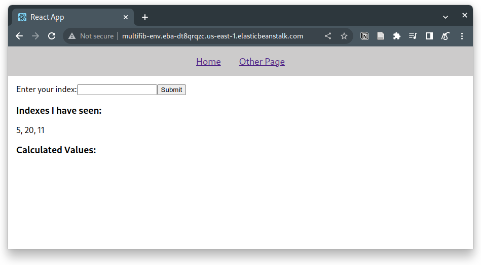
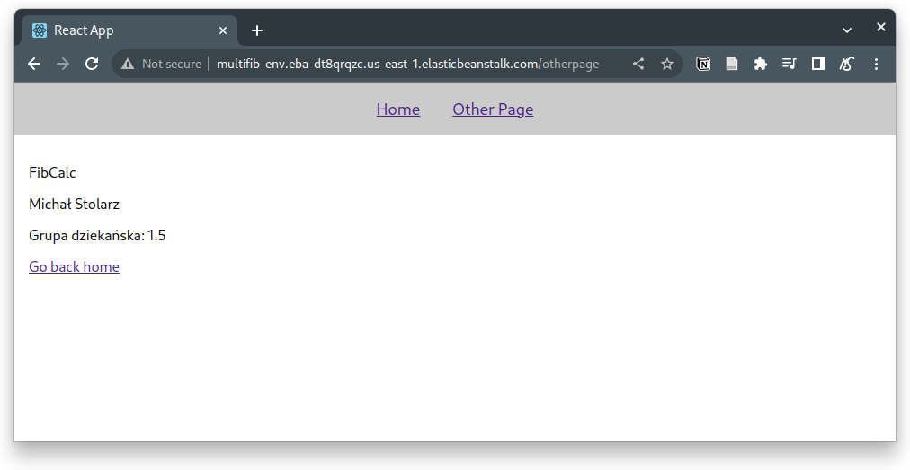
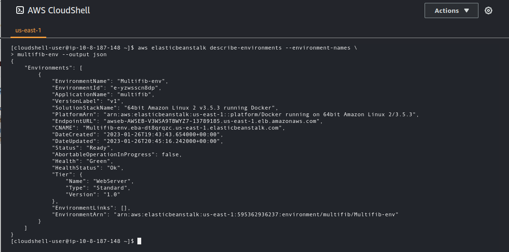

# Zadanie 2

W kodzie klienta React dokonano drobnych zmian polegających na usunięciu zbędnych elementów.

Zrzut ekranu z interfacem kalkulatora:

Zrzut ekranu zawierający inne dane:

Wynik działania polecenia:

